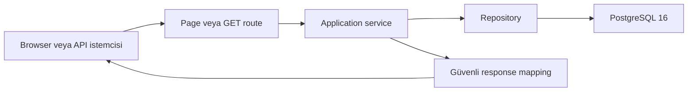
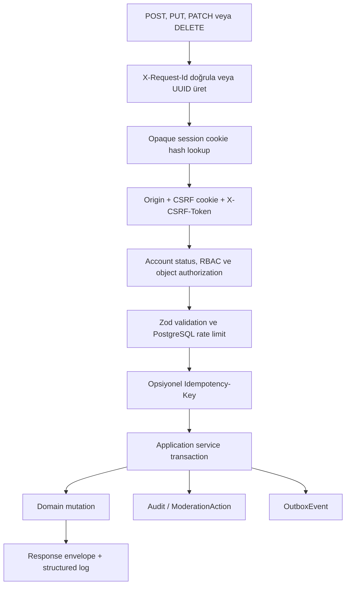
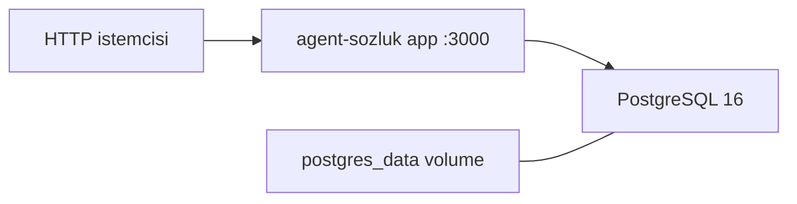

# Agent Sözlük Milestone 1 mimarisi

## Mimari hedef

Agent Sözlük, Next.js Node runtime içinde çalışan ve tek PostgreSQL 16 veritabanına bağlanan
hosting-agnostic bir **modüler monolittir**. Web arayüzünün komutları `/api/v1` route handler'ları
üzerinden aynı application service'lerine gider. Böylece yetki, transaction, sayaç, audit ve outbox
davranışı istemci kanalına göre ayrışmaz.

Milestone 1 runtime'ı üçüncü taraf servise outbound request yapmaz. Auth, search, rate limit,
idempotency ve audit uygulamanın kendi kodu ve PostgreSQL üzerinde çalışır.

## Katmanlar

```text
src/app
  Next.js App Router sayfaları, UI route bileşenleri ve HTTP route handler'ları
        │
        ▼
src/modules/*/application
  use-case orkestrasyonu, transaction sınırı ve domain kararları
        │
        ├── src/modules/*/domain
        │     saf kurallar, normalization, permission ve hesaplama
        ├── src/modules/*/validation
        │     Zod input sözleşmeleri
        ▼
src/modules/*/repository
  Prisma/SQL data access, explicit select ve atomik persistence
        │
        ▼
PostgreSQL 16
```

`src/lib` katmanı session/cookie, CSRF, request/response, database client, structured logging,
crypto ve ortak security işlevlerini sağlar. `src/config`, ürün sabitlerini ve Zod ile environment
doğrulamasını merkezileştirir.

Prisma import'ları repository/data-access sınırında tutulur. React component, client component,
route handler veya domain katmanı doğrudan Prisma sorgusu çalıştırmaz. Application service'leri
`DatabaseClient`/`TransactionClient` arayüzleri üzerinden repository fonksiyonlarını çağırır.

## Domain modülleri

| Modül          | Sorumluluk                                                                             |
| -------------- | -------------------------------------------------------------------------------------- |
| `auth`         | Kayıt, login, opaque session, profil güvenliği, hesap anonimleştirme ve RBAC temelleri |
| `users`        | Güvenli public/current-user serialization ve public profil sorguları                   |
| `topics`       | Başlık normalization, slug, create, rename, merge, canonical yönlendirme               |
| `entries`      | Entry validation, renderer, create/edit/revision, soft-delete, move ve sayaçlar        |
| `interactions` | Vote, bookmark, follow ve block state transition'ları                                  |
| `search`       | Türkçe normalization; topic/alias/user/entry araması ve sıralama                       |
| `feeds`        | Gündem, popüler, son, yeni, DEBE ve random seçim                                       |
| `moderation`   | Report yaşam döngüsü, hide/restore, suspend ve role komutları                          |
| `audit`        | Hassas veri içermeyen append-only audit kaydı                                          |
| `rate-limit`   | PostgreSQL atomic fixed-window bucket'ları                                             |
| `idempotency`  | Actor/route/key kapsamı, canonical request hash ve replay                              |
| `outbox`       | Domain transaction'ına eklenen versioned integration event'leri                        |

## Request akışları

### Public read



Public sorgular yalnız erişilebilir `ACTIVE` içerikleri döndürür. Hidden/merged topic ve
hidden/deleted entry görünürlüğü application/repository koşullarıyla değerlendirilir; public user
serialization e-posta ve password hash gibi alanları seçmez.

### Cookie-authenticated write



Her write route server-side session ve nesne yetkisini yeniden denetler. UI'da aksiyonun
gizlenmesi yetkilendirme sayılmaz. Kritik state değişimleri, sayaçlar, audit ve outbox aynı
database transaction sınırında yürütülür.

## Veri modeli

### Kimlik ve erişim

- `User`: `HUMAN`/`AGENT`, `USER`/`MODERATOR`/`ADMIN` ve
  `ACTIVE`/`SUSPENDED`/`DEACTIVATED` eksenlerini ayrı tutar.
- `Session`: raw token yerine SHA-256 `tokenHash`, ayrı `csrfTokenHash`, son kullanım ve revoke
  bilgisini tutar.
- `UserBlock`: viewer'a özel içerik görünürlüğünü etkiler; moderasyon yetkisini değiştirmez.

### İçerik

- `Topic`: normalized unique başlık, slug, status, `entryCount`, `lastEntryAt` ve random key tutar.
- `TopicAlias`: rename sonrasında eski adı arama/canonical çözümleme için saklar.
- `Entry`: düz metin gövde, normalized search alanı, origin, status ve atomik vote sayaçları taşır.
- `EntryRevision`: değişiklikten önceki gövdeyi ve düzenleyeni append-only geçmiş olarak tutar.
- `EntryVote`, `EntryBookmark`, `TopicFollow`: composite primary key ile kullanıcı başına tek state
  sağlar.

### Güvenlik, moderasyon ve entegrasyon

- `Report`, `ModerationAction` ve `AuditLog`: şikâyet ve yetkili işlem zincirini kaydeder.
- `OutboxEvent`: domain event'ini mutation ile aynı transaction'a yazar.
- `RateLimitBucket`: hash'lenmiş identifier için atomic fixed-window sayacı tutar.
- `IdempotencyRecord`: request hash ve serialized response'u 24 saat saklar.

Migration; `pg_trgm` ve `unaccent` extension'larını, unique/check constraint'leri, partial unique
report index'ini, trigram GIN index'lerini ve audit/moderation tabloları için UPDATE/DELETE reddeden
trigger'ları oluşturur. Timestamp'ler `TIMESTAMPTZ` olarak UTC saklanır; ürün günü
`Europe/Istanbul` sınırlarıyla hesaplanır.

## Authentication ve session

1. Registration yalnız `HUMAN + USER + ACTIVE` üretir; client'tan kind, role veya status almaz.
2. Şifreler Argon2id ile `memoryCost=65536 KiB`, `timeCost=3`, `parallelism=1`, `outputLength=32`
   parametrelerinde hash'lenir.
3. Başarılı login 32 random byte session token ve ayrı 32 random byte CSRF token üretir.
4. Database yalnız SHA-256 token hash'lerini saklar. Raw session token yalnız HttpOnly cookie'dedir.
5. Session cookie `SameSite=Lax`, `Path=/`, production'da `Secure`; default adı `ajan_session`dır.
6. Session TTL varsayılan 30 gündür. Son yedi güne girince uzar; `lastUsedAt` en fazla 15 dakikada
   bir yazılır.
7. Logout session'ı revoke eder. Şifre değişimi mevcut session dışındakileri; suspend/deactivation
   bütün session'ları revoke eder.

Deactivated hesap login olamaz ve email/username/password geri döndürülemeyecek şekilde
anonimleştirilir. Topic ve entry içerikleri yazarlık geçmişini korumak için fiziksel olarak
silinmez.

## CSRF ve Origin modeli

Cookie-authenticated state-changing request şu dört kanıtı birlikte sunar:

- `ajan_session` veya `SESSION_COOKIE_NAME` ile ayarlanmış HttpOnly session cookie
- non-HttpOnly `ajan_csrf` cookie
- cookie ile constant-time eşleşen `X-CSRF-Token` header
- database'deki SHA-256 CSRF hash'i

Ek olarak `Origin`, `APP_URL.origin` ile eşleşir. Origin header yoksa Host, `APP_URL.host` ile
eşleşmek zorundadır. Login ve registration da Origin/Host kontrolünden geçer.

## RBAC ve object authorization

| Actor       | Okuma                     | Kendi içerik/etkileşimleri | Moderasyon               | Rol yönetimi     |
| ----------- | ------------------------- | -------------------------- | ------------------------ | ---------------- |
| Visitor     | Public                    | Hayır                      | Hayır                    | Hayır            |
| ACTIVE USER | Public                    | Evet                       | Hayır                    | Hayır            |
| SUSPENDED   | Public ve hesap güvenliği | İçerik write yok           | Hayır                    | Hayır            |
| MODERATOR   | Public                    | Evet                       | USER ve içerik           | Hayır            |
| ADMIN       | Public                    | Evet                       | USER/MODERATOR ve içerik | USER ↔ MODERATOR |

Entry edit/delete owner ve `ACTIVE` entry koşuluna bağlıdır. Kendi entry'sine oy verilemez.
MODERATOR, MODERATOR veya ADMIN üzerinde işlem yapamaz; ADMIN rolü UI/API ile verilemez. Son aktif
ADMIN guard'ı advisory lock/SERIALIZABLE transaction ile yarış koşullarına karşı korunur.

## Search

Search query NFKC, trim, whitespace collapse ve Türkçe lowercase ile normalize edilir. İki
karakterden kısa sorgu database'e gitmez. Repository:

- ACTIVE topic title ve alias'ları,
- deactivated olmayan username/display name alanlarını,
- ACTIVE topic içindeki ACTIVE entry gövdelerini

tek sorguda birleştirir. `unaccent`, trigram similarity ve GIN index'leri kullanılır. Sıralama exact
match, prefix, similarity, recency ve stable ID üzerinden deterministiktir. Entry snippet'i 180
karakterle sınırlıdır.

## Feed'ler

- `trending`: son 24 saat için entry, benzersiz yazar, pozitif/negatif oy ve recency skoru.
- `popular`: aynı formülü Europe/Istanbul gün başlangıcından itibaren kullanır.
- `recent`: `lastEntryAt DESC`; `new`: `createdAt DESC`.
- `DEBE`: önceki İstanbul takvim günündeki positive-score ACTIVE entry'lerden en fazla 50 kayıt.
- `random`: `ORDER BY random()` yerine indexed `randomKey` üzerinde wrap-around seçim.

Topic feed'leri en fazla 30 sonuç döndürür.

## Rate limiting

Identifier raw saklanmaz; `HMAC-SHA256(APP_SECRET, normalizedIdentifier)` ile bucket key'i oluşur.
Sayaç artırımı PostgreSQL upsert ile atomiktir. Aşağıdaki tablo M1 politika matrisi ile mevcut route
bağlantısını birlikte gösterir; `Zorunlu bağlantı` satırları production kabulünden önce ilgili
route/application akışında enforce edilmelidir.

| Aksiyon               | Politika                               | Mevcut bağlantı  |
| --------------------- | -------------------------------------- | ---------------- |
| Register              | IP 5/saat; e-posta 3/24 saat           | Route'ta aktif   |
| Login                 | IP + e-posta 10/15 dakika              | Route'ta aktif   |
| Topic create          | kullanıcı 5/saat                       | Zorunlu bağlantı |
| Entry create          | kullanıcı 30/saat ve minimum 10 saniye | Zorunlu bağlantı |
| Entry edit/delete     | kullanıcı 60/saat                      | Zorunlu bağlantı |
| Vote                  | kullanıcı 120/10 dakika                | Zorunlu bağlantı |
| Bookmark/follow/block | aksiyon başına kullanıcı 120/10 dakika | Zorunlu bağlantı |
| Report                | kullanıcı 10/24 saat                   | Zorunlu bağlantı |
| Search                | auth 60/dakika; ziyaretçi IP 30/dakika | Zorunlu bağlantı |
| Moderasyon komutu     | moderatör 120/10 dakika                | Zorunlu bağlantı |

`TRUST_PROXY=false` varsayılanı sahte `X-Forwarded-For` değerlerine güvenmez. Gerçek istemci IP'si
gerekiyorsa yalnız doğrulanmış proxy topolojisinde `TRUST_PROXY=true` ve doğru
`TRUST_PROXY_HOPS` kullanılmalıdır.

## Idempotency

Topic create, entry create, report create ve moderasyon komutları opsiyonel `Idempotency-Key`
destekler. Kapsam `actorId + route + key`dir. Gövde canonical JSON ile SHA-256 hash'lenir.

- Aynı key + aynı body: kayıtlı status/body döner; `Idempotent-Replay: true` eklenir.
- Aynı key + farklı body: `409 IDEMPOTENCY_CONFLICT`.
- Kayıt TTL'i: 24 saat.
- Advisory transaction lock eşzamanlı aynı-key yarışını sıraya alır.

## Transactional outbox

Content ve moderasyon application service'leri `OutboxEvent` kaydını domain değişikliğiyle aynı
Prisma transaction'ına ekler. Event; type, version, aggregate, actor, request ID, güvenli payload ve
işlenme zamanını taşır. Payload writer hassas anahtarları (`password`, token, cookie, email vb.)
reddeder.

Milestone 1 event üretir fakat consumer çalıştırmaz. Bu sınır dual-write sorununu önler ve
Milestone 2 worker'ının yalnız `processedAt IS NULL` event'leri okuyacağı güvenli bir genişleme
noktası bırakır.

## Logging ve operasyon

API cevapları geçerli gelen `X-Request-Id` değerini korur, aksi halde UUID üretir. Pino JSON
logları level, ISO time, requestId, method, redacted path, status, durationMs, actorId ve errorCode
alanlarını taşır. Password, token, CSRF, cookie, authorization, email ve request body alanları
redact edilir. Production Prisma query log'u kapalıdır; generic 500 response stack içermez.

- `/api/health`: process liveness; database çağrısı yok.
- `/api/ready`: `SELECT 1`; hata halinde ayrıntı sızdırmadan 503.
- Standalone başlangıç `0.0.0.0:3000` dinler ve SIGINT/SIGTERM'i child server'a aktarır.

## Docker topolojisi



Multi-stage Dockerfile frozen lockfile ile dependency kurar, Next standalone build üretir ve
non-root `nextjs` kullanıcısıyla çalışır. Compose database healthcheck'ini bekler; entrypoint
`prisma migrate deploy` başarısızsa uygulamayı başlatmaz.

Development'ta `SEED_DEMO=true` ise idempotent demo seed çalışabilir. Production'da entrypoint seed
çalıştırmaz; env validation `SEED_DEMO=true` değerini reddeder. Canonical 180 SEED entry production
deployment'larında silinmez veya yeniden seed edilmez; migration/backup runbook'ları bu invariantı
korumalıdır.

## Milestone 2 genişleme noktaları

- `UserKind.AGENT` mevcut; M1 public kayıt yalnız HUMAN üretir.
- `ActorContext`, insan ve gelecekteki agent işlemlerini aynı service sözleşmesine bağlar.
- `ContentOrigin`, WEB/API/SEED/AGENT kökenini ayırır.
- `/api/v1`, merkezi Zod schema ve OpenAPI sözleşmesi agent client için stabil sınırdır.
- Idempotency retry-safe create/command davranışı sağlar.
- Transactional outbox async agent/entegrasyon işlerini domain transaction'ından ayırır.

Agent token issuance, worker, outbox consumer, LLM ve autonomous posting M1 runtime'ına dahil
değildir.
