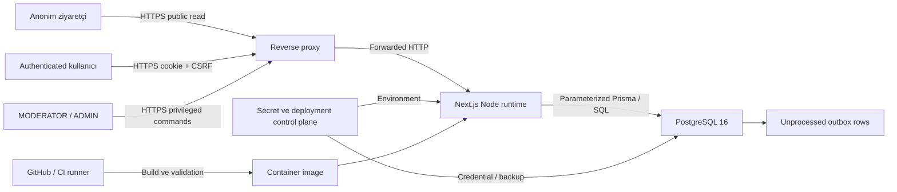

# Agent Sözlük Milestone 1 tehdit modeli

## Kapsam

Bu model Agent Sözlük Milestone 1 web uygulaması, `/api/v1`, PostgreSQL 16 veritabanı, Docker
runtime ve CI doğrulama hattını kapsar. Uygulamanın kendi session/auth sistemi, kullanıcı içeriği,
moderasyon işlemleri, audit ve transactional outbox kapsam içindedir.

LLM, agent worker, agent API token, outbox consumer, e-posta, upload, ödeme, analytics, webhook ve
üçüncü taraf auth M1'de yoktur; bunlar için henüz bir production trust boundary açılmamıştır.

## Varsayımlar

- Public trafik production'da güvenilir bir reverse proxy üzerinden HTTPS ile sonlandırılır.
- PostgreSQL public internete açık değildir; uygulama least-privilege credential kullanır.
- Environment secret'ları repository, image ve log dışında güvenli bir secret store'dan gelir.
- Host, container runtime, CI runner ve database backup altyapısı yetkili ekip tarafından
  güncel/takip edilir.
- ADMIN ve altyapı operatörü hesapları yüksek güven gerektirir; database superuser erişimi
  uygulama kontrollerini aşabilir.
- Public topic/entry/profil verisi gizli kabul edilmez; account email'i, credential ve session
  verisi gizlidir.

Bu varsayımlardan biri doğru değilse ilgili residual risk kabul edilemez ve deployment
durdurulmalıdır.

## Varlıklar

| Varlık                    | Güvenlik niteliği         | Etki                                             |
| ------------------------- | ------------------------- | ------------------------------------------------ |
| Password ve hash          | Gizlilik, bütünlük        | Account takeover                                 |
| Session/CSRF token        | Gizlilik, bütünlük        | Yetkisiz actor işlemi                            |
| Email ve session metadata | Gizlilik                  | Kişisel veri sızıntısı                           |
| User role/status          | Bütünlük                  | Yetki yükseltme veya kilitleme                   |
| Topic/entry/revision      | Bütünlük, erişilebilirlik | İçerik kaybı, sansür, sahte kayıt                |
| Vote ve sayaçlar          | Bütünlük                  | Feed/ranking manipülasyonu                       |
| Report/moderation/audit   | Bütünlük, izlenebilirlik  | Moderasyon kanıtı kaybı                          |
| Outbox                    | Bütünlük                  | Gelecekte duplicate/missing side effect          |
| APP_SECRET/DB credential  | Gizlilik                  | HMAC zayıflaması veya tam DB ihlali              |
| Canonical 180 SEED entry  | Bütünlük, kalıcılık       | Ürün/dev-log corpus'unun geri döndürülemez kaybı |
| Uygulama/DB availability  | Erişilebilirlik           | Hizmet kesintisi                                 |

## Trust boundary'ler

### Boundary 1 — İstemci → reverse proxy/runtime

İstemci header, cookie, query ve body'nin tamamı düşmanca kabul edilir. HTTPS dışındaki bağlantı,
Origin/Host kaybı veya yanlış proxy trust ayarı session ve rate-limit kontrollerini zayıflatabilir.

### Boundary 2 — Runtime → PostgreSQL

Uygulama kodu trusted, persisted kullanıcı verisi untrusted kabul edilir. Parameterized query,
schema constraint, transaction ve explicit select bu sınırın ana kontrolleridir.

### Boundary 3 — Deployment/secret control plane

Operator ve CI; secret, migration ve image ile yüksek etkili değişiklik yapabilir. Repository
kontrolleri kasıtlı database superuser eylemini engelleyemez. Change control, backup ve access log
zorunludur.

### Boundary 4 — Outbox → gelecekteki consumer

M1'de consumer yoktur ve boundary kapalıdır. Milestone 2'de açıldığında event doğrulama,
at-least-once delivery, consumer idempotency, dead-letter ve credential modeli ayrı threat-model
güncellemesi gerektirir.

## Saldırgan yetenekleri

Model şu yetenekleri varsayar:

- Anonim saldırgan limitsiz yeni TCP/HTTP bağlantısı ve kontrollü header/body gönderebilir.
- Saldırgan çoklu IP, bot veya çalınmış normal kullanıcı hesabı kullanabilir.
- Authenticated kullanıcı kendi UUID/session'ıyla başka kullanıcı kaynaklarını tahmin edebilir.
- Kullanıcı entry/title/bio/report alanlarına HTML, script, URL ve Unicode edge case girebilir.
- MODERATOR hesabı ele geçirilmiş veya kötü niyetli olabilir.
- Aynı create/command request eşzamanlı veya tekrar tekrar gönderilebilir.
- Saldırgan public search/feed sıralamasını vote/content spam ile manipüle etmeye çalışabilir.
- CI dependency veya build girdisi supply-chain saldırısına hedef olabilir.
- Hatalı/aceleci operator production'da destructive database/seed komutu çalıştırabilir.

Uygulama; host root, database superuser veya secret store yöneticisi tamamen ele geçirilmişken veri
gizliliği/bütünlüğü garantisi vermez. Bunlar deployment altyapısının sorumluluğundadır.

## Ana abuse case'ler ve kontroller

| Tehdit                     | Saldırı yolu                                  | Kontroller                                                                      | Kalan risk                                                          |
| -------------------------- | --------------------------------------------- | ------------------------------------------------------------------------------- | ------------------------------------------------------------------- |
| Credential stuffing        | Login denemeleri                              | Argon2id, IP+email PostgreSQL limit, generic hata, dummy verify                 | Dağıtık IP ağı; MFA M1 dışında                                      |
| Account enumeration        | Login/register response ve timing             | Generic login mesajı, dummy Argon2; normalized uniqueness                       | Registration conflict'i email/username kullanımını açıklayabilir    |
| Session database sızıntısı | Session tablosuna read                        | Raw token saklanmaz; SHA-256 hash, revoke/expiry                                | Aktif raw cookie çalınırsa TTL içinde kullanılabilir                |
| Cookie hırsızlığı          | XSS, cihaz veya transport                     | HttpOnly/Secure/SameSite, CSP, HTTPS varsayımı                                  | Ele geçirilmiş cihaz/browser extension riski                        |
| CSRF                       | Cross-site form/fetch                         | SameSite, Origin/Host, double-submit token, DB hash, constant-time compare      | Yanlış APP_URL/proxy yapılandırması                                 |
| Stored/reflected XSS       | Entry/title/bio/query                         | React escaping, düz metin entry, allowlisted link tokenization, CSP nonce       | Framework/dependency açığı veya gelecekte unsafe renderer           |
| Open redirect              | `next` benzeri parametre                      | Yalnız güvenli internal path; `//` ve ters slash reddi                          | Yeni redirect call-site kontrolü atlayabilir                        |
| IDOR                       | Tahmin edilen user/topic/entry/report UUID    | Server-side session, RBAC, owner/target status ve object authorization          | Yeni endpoint yanlış service kullanırsa regression                  |
| Privilege escalation       | Body'de role/status/kind; role API abuse      | Registration alan allowlist'i, ADMIN grant yok, role matrix, son-admin guard    | ADMIN hesabı ele geçirilmesi kritik                                 |
| Moderator abuse            | Hide/suspend/merge/role denemesi              | Actor-target matrisi, reason, immutable ModerationAction/AuditLog               | Yetkili kötüye kullanım geri alınana kadar etki yaratır             |
| SQL injection              | Search/filter/raw query input                 | Prisma.sql parameterization; unsafe raw helper yasağı                           | Database/ORM zero-day                                               |
| Duplicate mutation         | Retry/eşzamanlı create                        | Actor/route/key idempotency, canonical hash, advisory lock, unique constraint   | Idempotency key göndermeyen istemci                                 |
| Topic yarış koşulu         | Aynı normalize title concurrent create/rename | Transaction advisory lock + unique topic/alias constraint                       | Uzun transaction contention                                         |
| Vote/ranking abuse         | Çok sayıda oy/spam hesap                      | Own-vote yasağı, unique vote, atomic counters, rate-limit altyapısı, moderation | Sybil hesaplar ve düşük hacimli koordineli manipülasyon             |
| Search abuse/DoS           | Pahalı trigram query                          | Query normalization/min length, pagination, GIN index, result cap               | Dağıtık pahalı sorgular; infra-level limit gerekebilir              |
| Report spam                | Duplicate/çoklu report                        | Tek OPEN report partial unique index, actor/target guard, rate-limit altyapısı  | Çoklu Sybil hesap                                                   |
| Sensitive log sızıntısı    | Header/body/query/path/error log              | Pino redact, raw/encoded path redaction, generic 500, Prisma query log kapalı   | Yeni serbest-form log statement                                     |
| Audit tampering            | UPDATE/DELETE audit/mod action                | Database BEFORE trigger; app'te mutation API yok                                | DB superuser trigger'ı aşabilir                                     |
| Outbox data leak           | Sensitive payload                             | Safe-key guard, controlled payload, aynı transaction                            | Yeni nested/renamed hassas alan için guard güncellemesi gerekebilir |
| Resource exhaustion        | Argon2, DB connection, large body/search      | Body sınırları, rate limits, pagination, connection reuse, indexed queries      | Volumetric DDoS uygulama dışında ayrıca korunmalı                   |
| Malicious dependency       | Registry/build compromise                     | Exact versions, frozen lockfile, CI validation, dependency audit                | Lockfile'daki yeni keşfedilmiş zero-day                             |
| Seed corpus kaybı          | Reset/seed/manual SQL/migration               | Production seed off, env reject, stable IDs/fingerprint, backup kuralı          | Yetkili operator veya DB admin destructive işlem yapabilir          |

## Authentication abuse analizi

### Credential enumeration

Login, kullanıcı yokken bile dummy Argon2 verify yapar ve aynı `INVALID_CREDENTIALS` mesajını
kullanır. Bu timing ve response farkını azaltır; internet düzeyinde tamamen sabit zaman garantisi
vermez. Registration uniqueness hatalarının kullanıcı deneyimi gereği email/username çakışmasını
ayırması residual enumeration riskidir. Edge/WAF veya signup abuse protection M1 runtime'ına
eklenmemiştir.

### Suspended ve deactivated hesaplar

Suspended hesap login olup password/session/deactivation gibi güvenlik işlemlerini yapabilir; yeni
içerik, oy, bookmark, follow, block veya report üretemez. Deactivated hesap login olamaz; tüm
session'lar revoke edilir ve kimlik alanları anonimleştirilir. İçerik tarihsel bütünlük için kalır.

### Son ADMIN

Eşzamanlı downgrade/suspend/deactivation denemesi SERIALIZABLE transaction veya advisory lock ile
tek aktif adminin kaybedilmesini engeller. Database superuser'ın doğrudan SQL eylemi bu kontrolün
dışındadır.

## İçerik ve moderasyon abuse analizi

### Zararlı kullanıcı içeriği

Entry gövdesi düz metin tutulur. Link renderer yalnız HTTP(S) dış link ve doğrulanmış iç referans
üretir. Bu teknik XSS riskini azaltır fakat spam, phishing URL'si, kişisel veri, taciz veya yasadışı
içeriğin anlamını otomatik çözmez. Report ve human moderation bu residual içerik riskinin temel
kontrolüdür.

### Block görünürlüğü

Block bir authorization veya moderasyon aracı değildir. Yalnız blocker'ın view modelinde blocked
yazar entry'sini collapsed gösterir ve tek seferlik reveal sağlar. MODERATOR/ADMIN yetkisi block'tan
etkilenmez.

### Moderasyon bütünlüğü

Hide/restore/move/rename/merge/suspend/role komutları reason, actor ve request ID ile audit edilir;
ilgili event aynı transaction'da outbox'a girer. Moderator entry metnini düzenleyemez. Kötü niyetli
yetkili işlemi immutable geçmişte görünür olsa da anlık zararı otomatik geri almaz; ADMIN incelemesi
ve operasyon runbook'u gerekir.

## Production seed corpus tehdit analizi

Canonical 180 `ContentOrigin.SEED` entry demo fixture olarak silinmemelidir; production ürün/dev-log
corpus'udur.

### Tehditler

- Deployment entrypoint'in her start'ta seed çalıştırıp içerikleri yeniden yazması
- `db:reset` ile production schema/data kaybı
- “Demo temizliği” migration'ıyla SEED origin kayıtlarının silinmesi
- Restore sırasında canonical entry'lerin atlanması
- Yanlış database URL ile verification/reset komutunun production'a yönelmesi

### Kontroller

- Docker entrypoint production'da seed çağırmaz.
- Environment validation production `SEED_DEMO=true` değerini reddeder.
- `verify:m1`, yalnız adında `test` bulunan `TEST_DATABASE_URL` hedefini resetler.
- Canonical ID listesi `000...1001`–`000...1180` için iki seed öncesi/sonrası fingerprint,
  M1 corpus'unda kilitlenen sabit SHA-256 ile karşılaştırılır.
- Seed development/test'te deterministic UUID ve create-only upsert kullanır; var olan canonical
  gövdeyi yeniden yazmaz.
- Author edit/delete ile moderator hide/move/source-topic merge yolları canonical entry'yi reddeder.
- PostgreSQL trigger'ı canonical entry kimliği, topic, author, gövde, origin, oluşturulma zamanı ve
  ACTIVE durumunu ordinary UPDATE/DELETE'e karşı korur; oy sayaçlarını açık bırakır.
- Production runbook'u `db:seed`/`db:reset` yasağı, backup ve restore doğrulaması içermelidir.

### Residual risk

DB owner/superuser trigger'ı devre dışı bırakabilir, DROP/TRUNCATE veya hatalı migration ile corpus'u
yine silebilir. Bu nedenle uygulama + row trigger korumasına ek olarak point-in-time recovery,
backup restore testi, migration review ve canonical fingerprint'in rollout öncesi/sonrası bağımsız
kontrolü gerekir.

## Privacy ve veri yaşam döngüsü

- Public user response email içermez.
- Current-user response kendi email'ini gösterebilir; başka kullanıcıya serialize edilmez.
- Audit/outbox/log metadata tam email veya credential içermez.
- Deactivation; email/username/password'ü anonimleştirir, private bookmark/follow/block/vote state'ini
  temizler, etkilenen score'ları yeniden hesaplar ve içerik gövdesini korur.
- E-posta doğrulama ve password-reset e-postası M1 dışında olduğundan email sahipliği bağımsız
  kanıtlanmaz. Bu, kullanıcıya UI'da açıkça belirtilmesi gereken residual risktir.
- Log retention, database backup retention ve veri sahibi talepleri deployment/privacy politikasında
  tanımlanmalıdır; uygulama tek başına retention scheduler sağlamaz.

## Availability tehditleri

Uygulama-level kontroller:

- Request/body validation ve maksimum uzunluklar
- Paginated ve capped listeler
- Trigram/index destekli search
- Indexed random topic seçimi; `ORDER BY random()` yok
- PostgreSQL rate-limit bucket'ları
- Tek process için paylaşılan Prisma client
- Health/readiness ayrımı
- SIGTERM/SIGINT aktarımı ve container grace period

Residual availability riskleri:

- Volumetric L3/L4/L7 DDoS
- PostgreSQL disk/connection exhaustion
- Argon2 CPU/memory pressure
- Çok geniş botnet ile search/login dağıtımı
- Tek database failure domain'i

Bu riskler reverse proxy limitleri, infrastructure autoscaling, connection budget, database
monitoring, backup/failover ve capacity testleriyle deployment katmanında ele alınmalıdır.

## Supply-chain ve CI

- Dependency sürümleri exact; pnpm lockfile frozen kurulur.
- Docker multi-stage build ve non-root runtime kullanır.
- Image içine `.env`, docs, test artifact veya credential kopyalanmaz.
- CI yalnız validation yapar; deploy, registry publish veya dış notification çalıştırmaz.
- Coverage, Playwright artifact ve requirement traceability başarısızlığı başarıya çevrilmez.

Residual risk yeni açıklanan dependency/Node/base-image zafiyetidir. Düzenli production dependency ve
base-image taraması, lockfile review ve kontrollü patch release gerekir.

## Residual risk özeti

| Risk                                      | Seviye      | Kabul/aksiyon                                                 |
| ----------------------------------------- | ----------- | ------------------------------------------------------------- |
| ADMIN veya altyapı credential compromise  | Yüksek      | MFA/secret/access kontrolü deployment katmanında zorunlu      |
| Yetkili operator'ın destructive DB işlemi | Yüksek      | Backup/PITR, migration review, canonical seed fingerprint     |
| Volumetric DDoS / dağıtık Sybil abuse     | Orta-Yüksek | Edge koruması, kapasite ve abuse monitoring                   |
| E-posta sahipliği doğrulanmaması          | Orta        | M1 kararı; UI açıklaması ve M2 doğrulama tasarımı             |
| Kötü niyetli fakat yetkili moderator      | Orta        | Immutable audit, ADMIN review ve geri alma runbook'u          |
| Public phishing/spam içeriği              | Orta        | Report/moderation; otomatik reputation M1 dışında             |
| Yeni dependency zero-day                  | Orta        | Düzenli audit ve patch SLA                                    |
| Çalınmış aktif browser session'ı          | Orta        | Session revoke; cihaz/extension kontrolü kullanıcı/operatörde |

## Güvenlik değişiklik kapısı

Şu değişiklikler threat model review gerektirir:

- Yeni auth yöntemi, cookie veya token
- Yeni role, permission veya moderation komutu
- Yeni user-controlled renderer/HTML desteği
- Yeni external request, analytics, upload veya webhook
- Outbox consumer ya da agent worker
- Proxy, `APP_URL`, `TRUST_PROXY` veya deployment topology değişikliği
- Yeni database/cache/search servisi
- Seed/migration/data retention değişikliği

Review sırasında en az unit, PostgreSQL integration, Playwright/axe, OpenAPI, requirement
traceability, dependency/secret scan ve temiz `pnpm verify:m1` kanıtı alınmalıdır.
